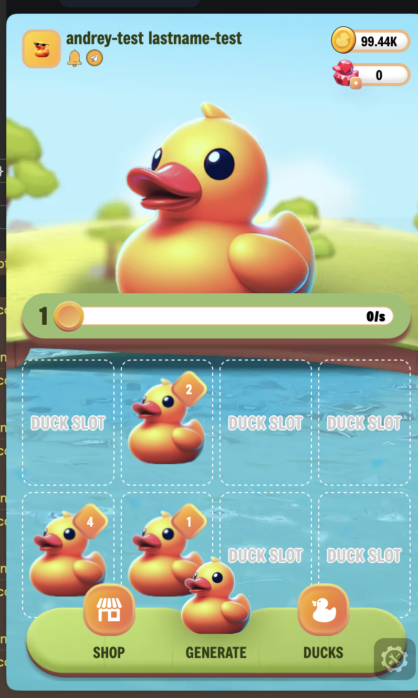
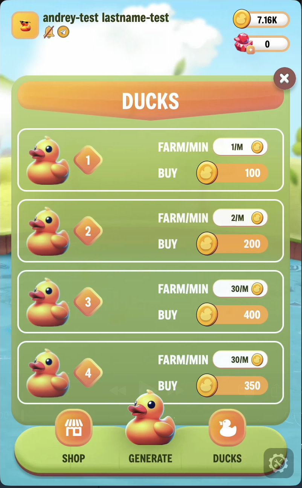

![][image-banner]

<br />
<div align="center">
   <h2 align="center">QuackUp - P2E Telegram Mini-App</h2>
</div>

## About The Project

A good P2E game template is built into the Telegram Mini App. The developed functionality of the game:

1. Tapping the duck.
2. Buying ducks of different levels.
3. Crossing ducks and getting a new level of duck
4. Getting a daily reward. Each duck gives a different profit (depending on the level) per minute.

Why is this template better than other P2E templates? The project scales well and is well written.

<br><br>

<div  align="center">
  </img>
  </img>
</div>
<br><br>

> \[!IMPORTANT]
>
> When launched locally, not via telegram, it will show an error. Since the application implements authorization via [@telegram-apps/sdk](https://docs.telegram-mini-apps.com/platform/authorizing-user)


### Running frontend locally in Telegram:

1. Log in to ngrok. Installing [ngrok](https://dashboard.ngrok.com/get-started/setup/macos) in stages.

2. Create .env file. Paste the required variables there -

```bash
#Backend BASE_URL. When launching via telegram you need https
REACT_APP_BASE_URL = "http://localhost:3001" 

#Default variable
REACT_APP_ENV = production
```

3. Launch the application locally -

```bash
cd ./quackup-front
npm install
npm run start
```

4. In a new window, run ngrok in parallel -

```bash
  ngrok http http://localhost:3000
```


5. In the window where ngrok is running, copy the Forwarding link (example - https://56d1599d2e12.ngrok.app )

6. Go to Telegram and find the chat bot - @BotFather.

7. Call the command "/new bot" in the chat. Creating a bot.

8. After creating the bot, enter the command - `/setMenuButton". And we set the copied link from point 4 for the button in your bot.

9. Next, go to the created bot and click on the button on the bottom left. Let's go code.

> \[!IMPORTANT]
>
> Every time you complete 3 points, a new link will be issued and you need to change it every time @BotFather.


## Running backend locally:

1. Create .env file. Paste the required variables there -

```bash

# DB Credentials.Required
PORT = 3001
DB_HOST = 'host'
DB_USER = 'username'
DB_PASSWORD = 'password'
DB_DATABASE = 'db name'


#Default variable. Required
NODE_ENV = 'production'

#This is an example. You need get your token for the app via @BotFather in Telegram. Required
BOT_TOKEN = '7084917293:AvAERcJ-hdHd3unL1UyIWalLyxj1ajEuuNfo'
```


2. Launch the backend locally -

```bash
cd ./quackup-front
npm install
npm run start
```


[image-banner]: ./images/banner.jpg
